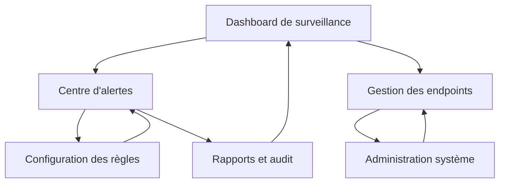

# ERDPS - Enterprise Ransomware Detection and Prevention System

## 1. Vue d'ensemble du produit

ERDPS (Enterprise Ransomware Detection and Prevention System) est une solution de cybersécurité d'entreprise conçue pour détecter, prévenir et neutraliser les attaques de ransomware en temps réel sur les postes Windows clients. Le système combine surveillance comportementale avancée, détection par signatures YARA, et réponse automatisée pour protéger les infrastructures critiques d'entreprise.

Le produit résout les problèmes de sécurité des environnements hybrides (on-premise et cloud) en offrant une protection proactive contre les ransomwares connus et zero-day, utilisable par les équipes IT et SOC d'entreprise.

Objectif : Fournir une solution de protection anti-ransomware de niveau militaire, déployable à grande échelle avec un budget maîtrisé.

## 2. Fonctionnalités principales

### 2.1 Rôles utilisateurs

| Rôle | Méthode d'enregistrement | Permissions principales |
|------|--------------------------|------------------------|
| Administrateur SOC | Authentification par certificat + MFA | Gestion complète du système, configuration des règles, actions de réponse |
| Opérateur IT | Compte Active Directory + certificat | Surveillance des endpoints, actions de base (isolation, scan) |
| Utilisateur final | Déploiement automatique via GPO | Aucune interaction directe, protection transparente |

### 2.2 Modules fonctionnels

Notre système ERDPS comprend les pages principales suivantes :

1. **Dashboard de surveillance** : vue d'ensemble temps réel, alertes critiques, statut des endpoints, métriques de sécurité
2. **Gestion des endpoints** : liste des machines protégées, statut des agents, actions de réponse à distance
3. **Centre d'alertes** : détection des menaces, analyse comportementale, gestion des incidents
4. **Configuration des règles** : gestion des signatures YARA, paramètres heuristiques, politiques de sécurité
5. **Rapports et audit** : journaux d'événements, rapports de conformité, analyse forensique
6. **Administration système** : gestion des utilisateurs, configuration réseau, mise à jour des agents

### 2.3 Détails des pages

| Nom de la page | Nom du module | Description des fonctionnalités |
|----------------|---------------|----------------------------------|
| Dashboard de surveillance | Vue d'ensemble temps réel | Afficher le statut global de sécurité, nombre d'endpoints protégés, alertes actives, graphiques de tendances des menaces |
| Dashboard de surveillance | Alertes critiques | Notifier les incidents de sécurité en cours, prioriser par niveau de criticité, actions rapides de réponse |
| Dashboard de surveillance | Métriques de performance | Monitorer la charge système des agents, latence réseau, taux de détection, faux positifs |
| Gestion des endpoints | Liste des machines | Inventorier tous les postes Windows protégés, statut de connexion, version de l'agent, dernière activité |
| Gestion des endpoints | Actions de réponse | Isoler un endpoint du réseau, tuer un processus suspect, lancer un scan complet, forcer une mise à jour |
| Gestion des endpoints | Déploiement d'agents | Installer l'agent ERDPS via GPO/Intune, configuration automatique, vérification d'intégrité |
| Centre d'alertes | Détection comportementale | Analyser les patterns de chiffrement massif, création de services persistants, injection de DLL, appels système suspects |
| Centre d'alertes | Moteur YARA | Exécuter les règles de détection en temps réel, mise à jour des signatures, gestion des exceptions |
| Centre d'alertes | Analyse Sysmon | Parser les logs Sysmon pour détecter CreateRemoteThread, modification de registre, exécution PowerShell suspecte |
| Centre d'alertes | Gestion des incidents | Créer des tickets d'incident, assigner aux équipes, suivi de résolution, escalade automatique |
| Configuration des règles | Signatures YARA | Créer et modifier les règles de détection, test en sandbox, déploiement sur les endpoints |
| Configuration des règles | Paramètres heuristiques | Configurer les seuils de détection, whitelist/blacklist, politiques de réponse automatique |
| Configuration des règles | Politiques de sécurité | Définir les actions par type de menace, niveaux d'autorisation, notifications |
| Rapports et audit | Journaux d'événements | Consulter l'historique complet des événements, recherche avancée, export sécurisé |
| Rapports et audit | Analyse forensique | Examiner les artefacts d'attaque, timeline des événements, corrélation multi-endpoints |
| Rapports et audit | Conformité réglementaire | Générer des rapports GDPR/ISO27001, métriques de sécurité, preuves d'audit |
| Administration système | Gestion des certificats | Déployer et renouveler les certificats TLS, authentification mutuelle, révocation |
| Administration système | Configuration réseau | Paramétrer les communications gRPC chiffrées, proxy d'entreprise, mode offline |
| Administration système | Mise à jour centralisée | Distribuer les mises à jour d'agents, signatures, règles de détection, rollback automatique |

## 3. Processus principal

### Flux opérationnel principal

**Flux de protection en temps réel :**
1. L'agent ERDPS-Client surveille en continu les activités système (fichiers, processus, réseau)
2. Les événements suspects déclenchent l'analyse comportementale et les règles YARA
3. Le moteur heuristique évalue la criticité et décide de l'action (alerte, blocage, isolation)
4. Les alertes sont transmises via gRPC chiffré au serveur ERDPS-Admin
5. L'équipe SOC reçoit les notifications et peut déclencher des actions de réponse
6. Les actions sont exécutées sur l'endpoint via communication bidirectionnelle sécurisée

**Flux d'administration SOC :**
1. Connexion sécurisée à la console web avec authentification par certificat
2. Surveillance du dashboard temps réel et gestion des alertes prioritaires
3. Investigation des incidents avec outils d'analyse forensique intégrés
4. Configuration des règles de détection et déploiement sur la flotte
5. Génération de rapports de conformité et métriques de sécurité

## 4. Design de l'interface utilisateur

### 4.1 Style de design

- **Couleurs principales :** Bleu foncé (#1a365d) pour l'interface principale, rouge (#e53e3e) pour les alertes critiques
- **Couleurs secondaires :** Gris anthracite (#2d3748) pour les sidebars, vert (#38a169) pour les statuts OK
- **Style des boutons :** Design moderne avec coins arrondis (border-radius: 6px), effets hover subtils
- **Police :** Inter ou Roboto, tailles 14px (texte), 16px (labels), 24px (titres)
- **Style de layout :** Interface dashboard avec sidebar fixe, cartes modulaires, navigation breadcrumb
- **Icônes :** Feather Icons ou Heroicons pour cohérence, style outline pour les actions secondaires

### 4.2 Aperçu du design des pages

| Nom de la page | Nom du module | Éléments UI |
|----------------|---------------|-------------|
| Dashboard de surveillance | Vue d'ensemble temps réel | Grid layout 3x2, cartes métriques avec graphiques Chart.js, palette de couleurs sombre, animations de transition fluides |
| Dashboard de surveillance | Alertes critiques | Liste verticale avec badges de priorité, couleurs d'état (rouge/orange/jaune), boutons d'action rapide, auto-refresh 5s |
| Gestion des endpoints | Liste des machines | Table responsive avec tri/filtrage, indicateurs de statut colorés, actions en dropdown, pagination |
| Gestion des endpoints | Actions de réponse | Modal de confirmation, boutons d'action avec icônes, progress bars pour les opérations longues |
| Centre d'alertes | Détection comportementale | Timeline verticale des événements, code highlighting pour les règles YARA, graphiques de corrélation |
| Centre d'alertes | Gestion des incidents | Kanban board pour le workflow, tags colorés par criticité, commentaires en temps réel |
| Configuration des règles | Signatures YARA | Éditeur de code avec syntax highlighting, preview en temps réel, validation automatique |
| Rapports et audit | Journaux d'événements | Table avec recherche avancée, export CSV/PDF, filtres par date/type/criticité |
| Administration système | Configuration réseau | Formulaires structurés avec validation, indicateurs de connectivité, tests de configuration |

### 4.3 Responsivité

L'interface est conçue desktop-first pour les environnements SOC professionnels, avec adaptation tablet pour les équipes mobiles. Optimisation tactile pour les écrans de contrôle et support multi-écrans pour les centres opérationnels.